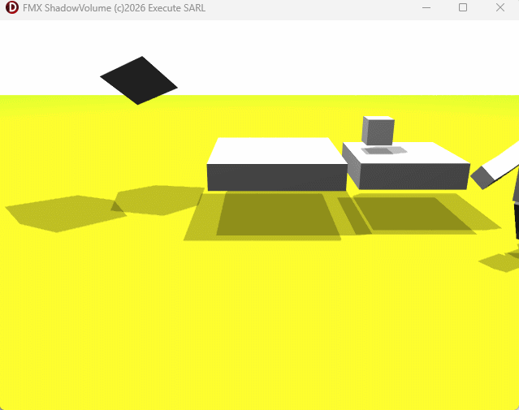

# FMX.ShadowVolume  
A FireMonkey (FMX) demonstration of stencil‑based Shadow Volumes for `TCube`

This repository contains a Delphi / FMX unit that implements real‑time **Shadow Volume** rendering on simple 3D objects (`TCube`).  
The goal is to provide a clean and understandable demonstration of how to generate and render geometric shadow volumes using the **stencil buffer**, a classic technique used in OpenGL and DirectX.

The project is intentionally simple and focuses on clarity rather than completeness, making it a good starting point for anyone exploring low‑level 3D shadow techniques in FMX.

---

## 🎯 Purpose

FMX does not provide built‑in shadow volumes, so this project shows how to:

- detect lit and shadowed faces of a cube  
- compute silhouette edges relative to a point light  
- extrude these edges to build a closed shadow volume  
- render the volume using the stencil buffer  
- support **both shadow‑volume rendering modes**:
  - **Z‑PASS**
  - **Z‑FAIL (Carmack’s Reverse)**

The implementation is self‑contained and designed for experimentation, learning, and extension.

---

## 📦 Contents

### **Main Unit**
`Execute.FMX.ShadowVolume.pas`

This unit includes:

- `TShadowVolume`  
- silhouette detection  
- volume extrusion  
- stencil setup and rendering  
- optional debug rendering (rays, volume outlines)  
- full support for **Z‑PASS** and **Z‑FAIL** modes via conditional compilation

### **Demo Project**
A small FMX application demonstrating:

- a cube illuminated by a point light  
- the generated shadow volume  
- the final shadow mask rendered via stencil operations  
- optional visualization of rays and extruded geometry

---

## 🔍 How It Works

1. **Face classification**  
   Each cube face is tested against the light direction to determine whether it is lit or shadowed.

2. **Silhouette extraction**  
   Edges between lit and shadowed faces form the silhouette.

3. **Volume construction**  
   Silhouette edges are extruded away from the light to form quads.  
   Shadowed faces are used as near caps, and extruded faces form far caps.

4. **Stencil rendering**  
   The volume is rendered twice (front faces and back faces) with increment/decrement operations.  
   The final shadowed region is where the stencil value is non‑zero.

Both **Z‑PASS** and **Z‑FAIL** are implemented, allowing the demo to illustrate the differences between the two techniques and the situations where each mode is appropriate.

---

## 🖼 Screenshots

The repository includes several images showing:

- the cube  
- the extruded shadow volume  
- the stencil mask  
- the final shadow overlay

---

## ⚠️ Limitations

This is a demonstration, not a full shadow system:

- only `TCube` is supported  
- no soft shadows  
- no caps for arbitrary open geometry  
- no support for concave or complex meshes  
- no optimization for large scenes

Still, it provides a solid foundation for extending shadow volumes to other FMX 3D objects.

---

## 📄 License

This project is released under the MIT License.  
You are free to use, modify, and integrate it into your own applications.

---

## 🤝 Contributions

Contributions, improvements, and extensions are welcome.  
Feel free to open issues or submit pull requests.

